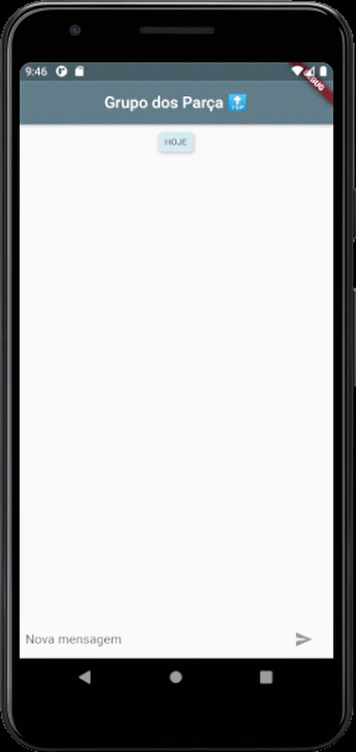

## FriendlyChat - Chat dos Parça
> Aplicativo de chat usando Flutter.

Eae, tudo bem?

Fiz este aplicativo para estudar um pouco mais sobre Flutter. Para este projeto estou utilizando como base este [codelab](https://codelabs.developers.google.com/codelabs/flutter). Também estou usando o package [bubble](https://pub.dev/packages/bubble) para criar os balões de mensagem.

## Faça Contato 🛸

João Paulo Zorek 

Pelo Instagram: [@joaopaulozorek](https://instagram.com/joaopaulozorek)

Ou por e-mail: joaopaulozorek@gmail.com

Espero seu Olá! 👽
